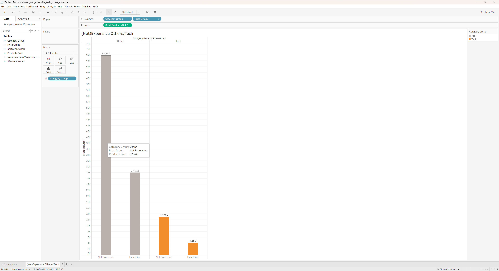

# Eniac–Magist Partnership Analysis with SQL & Tableau

## 🎯 Project Overview

Eniac, a company focused on premium technology products such as iPhones and accessories, is considering Magist as a potential business partner. This project evaluates whether Magist offers a suitable market for Eniac's high-end tech portfolio and whether its delivery performance is reliable enough for a partnership.

Using SQL for business exploration and Tableau for visual analysis, the project compares Tech and Non-Tech performance, premium vs lower-priced products, seller and order development, and delivery behaviour. The final recommendation is to **reassess the partnership opportunity in 6 months rather than proceed immediately**.

## 📊 Dataset & Sources

- **Source:** Dataset provided by WBS Coding School for the Magist business case
- **Data format:** Relational CSV tables imported into MySQL
- **Raw tables included:**
  - `customers.csv`
  - `geo.csv`
  - `order_items.csv`
  - `order_payments.csv`
  - `order_reviews.csv`
  - `orders.csv`
  - `product_category_name.csv`
  - `products.csv`
  - `sellers.csv`
- **Observed timeframe:** Order activity from 2016 to August 2018
- **Delivery analysis:** 96,476 deliveries were included in the presentation analysis
- **Key variables:** product category, item price, order status, order timestamps, seller ID, product ID, customer ID
- **Tech classification:** 8 product categories were classified as Tech:
  - `telephony`
  - `tablets_printing_image`
  - `computers`
  - `computers_accessories`
  - `audio`
  - `electronics`
  - `consoles_games`
  - `pc_gamer`
- **Price classification:** Products priced above the overall average item price were classified as `Expensive`; all others as `Not Expensive`
- **Preprocessing:** Product category names were translated to English and analytical result sets were exported as processed CSV files for Tableau

## 🚀 Key Findings & Results

- **Tech contributes only 14% of Magist's total revenue**, generating approximately **€1.84M of €13.6M** total revenue.
- **Computer Accessories is the only Tech category competing with Magist's strongest Non-Tech categories.** All other Tech categories generate less than 50% of the revenue of the 8th-largest Non-Tech category.
- **Premium Tech shows substantially lower sales volume:** 12,779 non-expensive Tech products were sold compared with only 4,156 expensive Tech products.
- **Magist's Tech market appears more price-sensitive than premium-oriented**, which creates a potential market-fit risk for Eniac's high-end product portfolio.
- **Tech order development weakened after the end of 2017**, while the Tech seller base continued to grow, suggesting increasing seller competition without equivalent Tech demand growth.
- **92% of deliveries arrived on time**, while approximately **8% were delayed**.
- Delays are often substantial: the average carrier-to-customer stage was approximately **27.6 days for delayed orders**, compared with **8.0 days for on-time orders**.
- **Business recommendation:** Do not enter the partnership immediately. **Reassess Magist as a potential partner in 6 months**, focusing especially on premium-Tech demand and delivery performance.

## 🛠️ Technologies Used

- **Database & Querying**
  - MySQL
  - MySQL Workbench
  - SQL
- **Data Visualisation**
  - Tableau Public
- **Data Handling**
  - CSV
- **Presentation**
  - Google Slides
  - PDF
- **Version Control & Portfolio**
  - Git
  - GitHub

## 📁 Project Structure

```text
sql_business_exploration/
│
├── README.md
│
├── data/
│   ├── raw/
│   │   ├── customers.csv
│   │   ├── geo.csv
│   │   ├── order_items.csv
│   │   ├── order_payments.csv
│   │   ├── order_reviews.csv
│   │   ├── orders.csv
│   │   ├── product_category_name.csv
│   │   ├── products.csv
│   │   └── sellers.csv
│   │
│   └── processed/
│       └── CSV outputs created from SQL analysis
│
├── sql/
│   └── eniac_magist_analysis.sql
│
├── tableau/
│   └── exports/
│       ├── Tableau workbook example
│       └── Tableau visualisation export
│
└── presentation/
    └── Eniac - Magist Partnership Analysis Presentation.pdf
```

## 📈 Visualisations

### Expensive vs Non-Expensive Products: Tech vs Other

This Tableau visualisation compares the sales volume of expensive and non-expensive products across Tech and Other categories. It highlights the substantially lower sales volume of expensive Tech products, which is one of the central market-fit concerns for Eniac.

> **Note:** Update the image path below if your PNG uses a different filename.

```markdown

```

Additional visualisations covering revenue distribution, Tech vs Non-Tech categories, seller/order development, and delivery performance are available in the final presentation:

[View the final Eniac–Magist presentation](presentation/Eniac%20-%20Magist%20Partnership%20Analysis%20Presentation.pdf)

## 🔗 How to Use This Project

1. **Start with the business outcome:** Open the [final presentation](presentation/Eniac%20-%20Magist%20Partnership%20Analysis%20Presentation.pdf) for the main findings and recommendation.
2. **Review the SQL analysis:** Open [`sql/eniac_magist_analysis.sql`](sql/eniac_magist_analysis.sql) to see the queries used for the business exploration.
3. **Inspect the source data:** The original datasets are stored in [`data/raw/`](data/raw/).
4. **Inspect analysis outputs:** SQL-generated result sets used for further analysis and visualisation are stored in [`data/processed/`](data/processed/).
5. **View the Tableau work:** Tableau files and exported visualisations are stored in [`tableau/exports/`](tableau/exports/).
6. **Reproduce the analysis:** Import the raw CSV files into MySQL, run the queries in `eniac_magist_analysis.sql`, and use the resulting data for visualisation in Tableau.

## 🚀 Future Work

- **Reassess the partnership after 6 months** using newer sales and logistics data.
- **Analyse premium-Tech demand in greater detail**, especially product segments that are closer to Eniac's iPhone-focused portfolio.
- **Monitor delivery performance** to determine whether substantial delays decrease over time.
- **Investigate regional and customer segments** to identify areas with stronger demand for high-end technology products.
- **Compare seller growth with buyer demand** to determine whether competition within Tech categories continues to increase.
- **Expand Tableau reporting** with additional interactive dashboards for product, revenue, and logistics analysis.

## 📧 Contact

- **Email:** `sharon.schwaab`
- **LinkedIn:** [Your LinkedIn Profile](https://www.linkedin.com/in/sharon-schwaab/)
- **GitHub:** [Your GitHub Profile](https://github.com/sharon-schwaab/)
